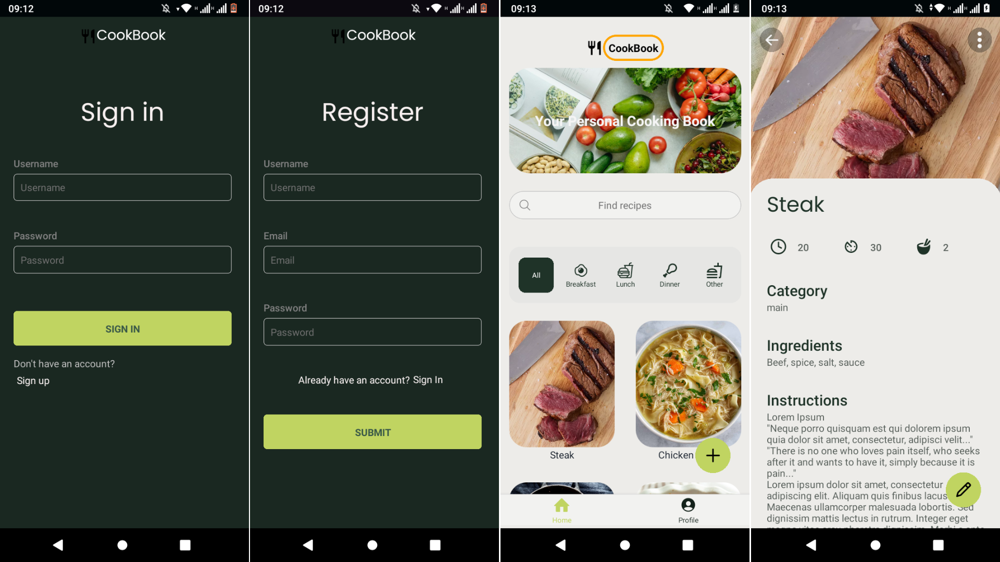

# Recipe App

React Native, MongoDb, Express, recipe app, where users can create and manage recipes.

## Prerequisites

- React Native
- Expo

## Installation

1. Clone the repository

```bash
git@github.com:Lspacedev/recipe-app.git
```

2. Navigate to the project folder

```bash
cd recipe-app
```

3.  Install all dependencies

```bash
npm install
```

4. Create an env file and add the following:

```bash
EXPO_PUBLIC_API_URL="Server url"
```

5. Run the project

```bash
npx expo start
```

In the output, you'll find options to open the app in a

- [development build](https://docs.expo.dev/develop/development-builds/introduction/)
- [Android emulator](https://docs.expo.dev/workflow/android-studio-emulator/)
- [iOS simulator](https://docs.expo.dev/workflow/ios-simulator/)
- [Expo Go](https://expo.dev/go), a limited sandbox for trying out app development with Expo

## Screenshot



## Features

- Create and login to an account.
- Update a profile.
- Create a recipe.
- Update a recipe.
- Delete a recipe.
- Search for a recipe.

## Usage

API is built using a Node Express server, with MongoDb as a database.
API uses JWT tokens to authenticate user.

API allows users to:

1. Add new item.
2. View already added items.
3. Update details of added items.
4. Delete added item.

API Endpoints:

1. GET /items.
2. GET /items/:itemId.
3. POST /items.
4. PUT /items/:itemId.
5. DELETE /items/:itemId.

Each item must have the following inputs:

1. Name.
2. Ingredients.
3. Instructions.
4. PrepTime.
5. CookingTime.
6. Servings.

## Credits

- Photo by ROMAN ODINTSOV: https://www.pexels.com/photo/vegetable-salad-served-on-table-with-beef-steak-in-restaurant-4551832/
- Photo by Yaroslav Shuraev: https://www.pexels.com/photo/fresh-vegetables-and-fruits-on-the-table-8844888/
- Photo by Yaroslav Shuraev: https://www.pexels.com/photo/top-view-of-a-cookbook-and-variety-of-healthy-foods-on-a-table-8851929/
- Photo by Polina Kovaleva: https://www.pexels.com/photo/assorted-vegetables-on-chopping-board-on-wooden-surface-5645089/

## Tech Stack / Tools

- React Native
- REST API
